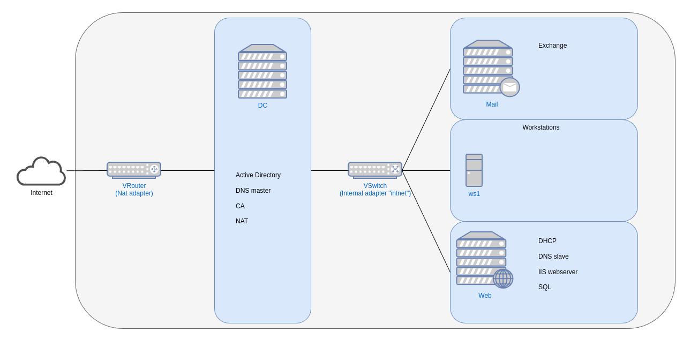

# Windows server II
 **Naam: Ube Uyttendaele**

 **Klas: G3.B**
## Inhoudstabel

 - [Vereisten](#vereisten)
 - [Resource toekenning](#resource-toekenning)
 - [Netwerk diagram](#netwerk-diagram)

## Vereisten
* Virtualbox + extension
* Virtualbox guestadditions ISO
* Windows server 2019 en 10/11 ISO
* Microsoft exchange ISO
* Powershell scripts die voorzien zijn

## Resource toekenning

__De resource toekenning kan nog mogelijks veranderen indien de huidige toekenning niet voldoende is__

| Device    |   Cores   |  Ram  	|  Storage  	| IP                        |
|-----------|-----------|-----------|---------------|---------------------------|
|   dc 	    |   2       |   2048	|  30GB	        | DHCP - 10.0.2.15          |
|    	    |           |          	|   	        | Static - 192.168.22.1     |
|   web 	|   2	    |   1024	|  30GB	        | Static - 192.168.22.2  	|
|   mail    | 	2       |   6144 	|  50GB         | Static - 192.168.22.3  	|
|   ws 	    |   1	    |   2048	|  25GB 	    | DHCP - 192.168.22.101-150 |

Hierboven vindt je een tabel met alle benodigdheden om deze opstelling te kunnen draaien op jouw host systeem en de ip addressen die aan de virtuele machines worden toegekend aan de hand van een powershell script of de DHCP server die draait op een van de servers. Met uizondering van de NAT adapter die op de domeincontroller "dc" staat. Deze krijgt een ip toegekend van een virtuele router die virtualbox aanmaakt op jouw host systeem om aan het internet aan te kunnen.
 
 
 
 
 
 
 
 
 

## Netwerk diagram

__Het netwerk diagram kan nog logelijks veranderen indien de rollen verplaatst worden naar een andere server__

Bij het toekennen van de resources heb ik besloten om 3 servers en 1 workstation te draaien met de bedoeling indien nodig dat er extra workstations kunnen worden toegevoegd.

Zoals de diagram het aantoont zal de DC rollen draaien gerelateerd met het domein. Deze zijn Active directory, de primairy dns server, de certificate authority en de NAT. De DC heeft 2 interfaces een NAT adapter die een ip krijgt via dhcp en een internal adapter met een static ip die het interne netwerk "intnet" in virtualbox gebruikt.

De "Web" server zal de rest van de rollen draaien buiten de exchange server die apart staat op "Mail". Deze zal de dhcp server, de secundairy dns server, de IIS webserver en SQL server draaien. Beide servers zijn aangesloten op het interne netwerk "intnet" met een internal adapter in virtualbox en worden een static ip adres toegekend.

Vervolgens heb je de groep workstations, deze zullen een ip adres toegekend krijgen van de DHCP server die op "Web" draait. Net zoals de rest van de toestellen zullen deze aangesloten zijn met een internal adapter op het netwerk "intnet".

Elke server zal lid zijn van het domein "ws2-2223-ube.hogent".

