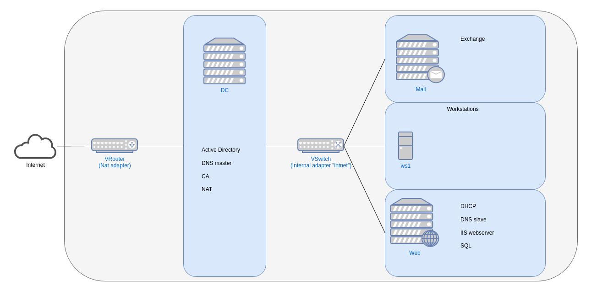

# Windows server II
 **Naam: Ube Uyttendaele**

 **Klas: G3.B**

## Inhoudstabel
  1. [Vereisten](#1-vereisten)
  2. [Resource toekenning](#2-resource-toekenning)
  3. [Netwerk diagram](#3-netwerk-diagram)

## 1. Vereisten
* Virtualbox + extension
* Virtualbox guestadditions ISO
* Windows server 2019 en 10/11 ISO
* Microsoft exchange ISO
* Powershell scripts die voorzien zijn

## 2. Resource toekenning

__De resource toekenning kan nog mogelijks veranderen indien de huidige toekenning niet voldoende is__

| Device    |   Cores   |  Ram  	|  Storage  	| IP                        |
|-----------|-----------|-----------|---------------|---------------------------|
|   dc 	    |   2       |   2048	|  30GB	        | DHCP - 10.0.2.15          |
|    	    |           |          	|   	        | Static - 192.168.22.1     |
|   web 	|   2	    |   1024	|  30GB	        | Static - 192.168.22.2  	|
|   mail    | 	2       |   6144 	|  50GB         | Static - 192.168.22.3  	|
|   ws 	    |   1	    |   2048	|  25GB 	    | DHCP - 192.168.22.101-150 |

## 3. Netwerk diagram

__Het netwerk diagram kan nog logelijks veranderen indien de rollen verplaatst worden naar een andere server__

